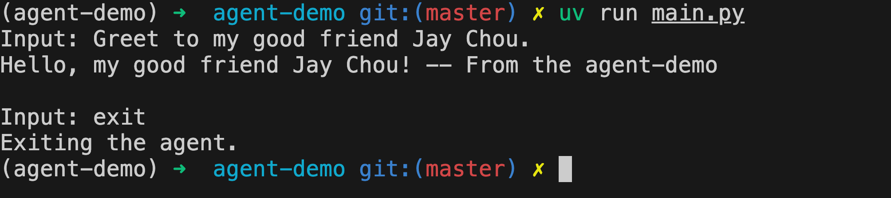

# agent-demo

1. 初始化一个项目：

    ```bash
    uv init agent-demo && cd agent-demo
    uv add dotenv pydantic-ai
    ```

2. 编辑 *main.py*：

    ```python
    from dotenv import load_dotenv
    from pydantic_ai.agent import Agent
    from pydantic_ai.models.gemini import GeminiModel
    
    load_dotenv()
    
    model = GeminiModel(model_name="gemini-2.0-flash")
    
    # Emulate a tool function
    def say_hello(name: str) -> str:
        """Greet to my good friend."""
        return f"Hello, my good friend {name}! -- From the agent-demo"
    
    agent = Agent(
        model=model,
        system_prompt="You are an expert in Python programming.",
        tools=[say_hello],  # Add your tools here, generally a list of functions
    )
    
    def main():
        history_messages = []
        while True:
            user_input = input("Input: ")
            if user_input.lower() in ["exit", "quit"]:
                print("Exiting the agent.")
                break
            response = agent.run_sync(user_input, message_history=history_messages)
            history_messages = list(response.all_messages())
            print(response.output)
    
    if __name__ == "__main__":
        main()
    ```

3. 创建 .env 文件并配置 GEMINI_API_KEY 环境变量

4. 运行：

    ```bash
    uv run mian.py
    ```

5. 输入 *Greet to my good friend Jay Chou.*

6. 效果如下：

    
